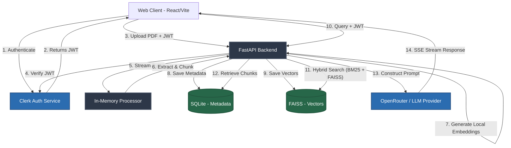

<div align="center">
  

  <h1>✨ Luminary</h1>
  <p><strong>A production-grade, privacy-first PDF intelligence platform.</strong></p>

  <p>
    <a href="#demo"></a>
    <a href="https://github.com/aditya/IntelliPDFChat/actions"></a>
    <a href="https://fastapi.tiangolo.com/"></a>
    <a href="https://reactjs.org/"></a>
    <a href="https://clerk.dev/"></a>
  </p>
</div>

---

## 📖 Product Overview

**Luminary** is an advanced AI-powered workspace designed to help users interactively converse with, extract insights from, and analyze complex PDF documents. 

In an era where data privacy is paramount, Luminary is built with a strict **privacy-first philosophy**: **raw PDF bytes are never stored on our servers.** Documents are processed purely in-memory, chunked, embedded locally via open-source embedding models, and discarded. Only the semantic intelligence remains, strictly scoped to the authenticated user.

### 🎯 Target Audience
- **Researchers & Academics:** Instantly query hundreds of pages of research papers.
- **Legal Professionals:** Rapidly locate clauses and semantic matches in dense contracts.
- **Enterprises:** A scalable, self-hostable solution ensuring proprietary documents never leak to third-party vector databases.

### ⚡ Core Features
- **Privacy-First Ingestion:** In-memory PDF parsing using PyMuPDF.
- **Local Embeddings:** Free, ultra-fast vectorization using `sentence-transformers` (all-MiniLM).
- **Hybrid Search RAG:** Combines FAISS (dense vector search) and BM25 (lexical keyword search) for unmatched retrieval accuracy.
- **Enterprise-Grade Auth:** Zero-trust architecture using Clerk JWT verification.
- **Three-Panel UI:** A beautiful, dark-themed React workspace featuring a document list, active PDF viewer, and real-time streaming chat.

---

## 🏗️ Architecture Overview

Luminary uses a decoupled client-server architecture. The frontend handles the complex three-panel state and streaming, while the backend acts as a stateless processing engine (with the exception of the local FAISS index and SQLite metadata).

### High-Level System Flow



### The Request Lifecycle
1. **Authentication Gate:** Every API request includes a Bearer token. The backend intercepts this, downloads JWKS keys from Clerk, and cryptographically verifies the signature and expiration.
2. **Rate Limiting:** An in-memory rate limiter checks the verified `user_id` against daily limits (e.g., 50 queries/day).
3. **Execution & Scoping:** If passed, the request executes. All database queries append `.filter(User.clerk_id == current_user_id)` to guarantee tenant isolation.

---

## 🛠️ Tech Stack & Rationale

### Frontend
| Technology | Description | Why we chose it |
|------------|-------------|-----------------|
| **React 19** | UI Library | Modern hooks, concurrent rendering, and massive ecosystem. |
| **Vite** | Bundler | Near-instant HMR (Hot Module Replacement) and optimized builds. |
| **TailwindCSS v4** | Styling | Utility-first CSS for building a highly customized, responsive dark mode. |
| **Zustand** | State Management | Boilerplate-free, slice-based state management ideal for multi-panel layouts. |
| **react-pdf** | PDF Rendering | Robust rendering of PDF documents directly in the browser canvas. |

### Backend & AI
| Technology | Description | Why we chose it |
|------------|-------------|-----------------|
| **FastAPI** | Web Framework | Async by default, auto-generated OpenAPI docs, and extreme performance. |
| **PyMuPDF** | Document Parsing | Fastest C-based PDF parser available for Python; excellent text extraction. |
| **FAISS (CPU)** | Vector Database | Meta's library for efficient similarity search. Runs entirely locally to save costs. |
| **BM25** | Lexical Search | Complements FAISS by catching exact keyword/acronym matches that dense vectors miss. |
| **Sentence-Transformers** | Embeddings | `all-MiniLM-L6-v2` runs locally, ensuring document data never hits an external API. |
| **OpenRouter** | LLM Gateway | Agnostic routing to models like Claude 3.5 Sonnet or GPT-4o via standard OpenAI SDK. |

### Infra & Storage
| Technology | Description | Why we chose it |
|------------|-------------|-----------------|
| **SQLite (aiosqlite)** | Relational DB | Zero-config, single-file DB that easily handles millions of rows; perfect for metadata. |
| **Clerk** | Authentication | Drop-in React components and bulletproof JWKS backend verification. |

---

## 📂 Project Structure

```bash
Luminary/
 ├── backend/                   # Python FastAPI Server
 │    ├── main.py               # Application entry point & API routes
 │    ├── auth.py               # Clerk JWT verification & JWKS caching
 │    ├── database.py           # SQLAlchemy async engine & session management
 │    ├── models.py             # ORM models (User, Document, Chunk, ChatSession)
 │    ├── schemas.py            # Pydantic validation models
 │    ├── rate_limit.py         # In-memory rate limiting logic
 │    └── services/             # Core Business & AI Logic
 │         ├── chat.py          # OpenRouter SSE streaming integration
 │         ├── embeddings.py    # Local sentence-transformers embeddings
 │         ├── pdf_parser.py    # PyMuPDF parser and chunker
 │         ├── retrieval.py     # Hybrid search logic (BM25 + FAISS)
 │         └── vector_store.py  # Local FAISS index lifecycle manager
 │
 ├── frontend/                  # React 19 Frontend (Dashboard)
 │    ├── src/
 │    │    ├── components/      # UI components (SettingsPanel, SessionSidebar, etc.)
 │    │    ├── pages/           # Pages (LandingPage)
 │    │    ├── App.tsx          # Main three-panel layout orchestrator
 │    │    └── store.ts         # Zustand global state (auth, active doc, chat)
 │    ├── index.html            # Vite entry HTML
 │    ├── vite.config.ts        # Vite build configuration
 │    └── package.json          # Node dependencies
 │
 ├── mobile/                    # Phase 2: React Native Scaffold
 └── desktop/                   # Phase 2: Tauri Scaffold
```

---

## 🧠 The AI Pipeline (Hybrid RAG)

Luminary utilizes a highly optimized Retrieval-Augmented Generation (RAG) pipeline:

1. **Ingestion & Chunking:** When a PDF is uploaded, `PyMuPDF` reads the stream. The text is split into semantic chunks (e.g., 500 tokens) with overlap to preserve context.
2. **Local Embedding:** The chunks are passed through `sentence-transformers` running directly on the backend server. **Zero external API costs.**
3. **Indexing:** 
   - Vectors are added to the user's specific FAISS index on disk.
   - Text is indexed using BM25.
   - Metadata is stored in SQLite.
4. **Retrieval:** A user's query is embedded. We perform a K-Nearest Neighbors (KNN) search in FAISS and a keyword search in BM25. The results are scored via Reciprocal Rank Fusion (RRF).
5. **Generation:** The top chunks are injected into a strict system prompt and sent to OpenRouter. The response is streamed back to the client using Server-Sent Events (SSE).

---

## 🚀 Setup & Installation

### Prerequisites
- Python 3.11+
- Node.js 20+
- A Clerk Account (for Auth)
- An OpenRouter Account (for LLM generation)

### 1. Clone the repository
```bash
git clone https://github.com/yourusername/IntelliPDFChat.git
cd IntelliPDFChat
```

### 2. Backend Setup
```bash
cd backend
python -m venv venv
source venv/bin/activate  # On Windows: venv\Scripts\activate
pip install -r requirements.txt
```

### 3. Frontend Setup
```bash
cd ../frontend
npm install
```

### 4. Environment Variables
Create `.env` files in both directories based on their respective `.env.example` files.

**`backend/.env`**
```ini
CLERK_SECRET_KEY=sk_test_...
OPENROUTER_API_KEY=sk-or-v1-...
DATABASE_URL=sqlite+aiosqlite:///./luminary.db
```

**`frontend/.env`**
```ini
VITE_CLERK_PUBLISHABLE_KEY=pk_test_...
VITE_API_BASE_URL=http://localhost:8000
```

### 5. Run the Application
Start the backend (from `/backend`):
```bash
uvicorn main:app --reload
```

Start the frontend (from `/frontend`):
```bash
npm run dev
```
Navigate to `http://localhost:5173`.

---

## 📈 Scalability Considerations

While Luminary currently uses SQLite and FAISS for rapid deployment and zero-config setup, the architecture is designed to scale:
- **Database:** SQLAlchemy allows a seamless swap from SQLite to PostgreSQL when horizontal scaling is required.
- **Vector Store:** FAISS can be swapped for Pinecone, Weaviate, or pgvector by abstracting the `services/rag_engine.py`.
- **Stateless API:** The FastAPI backend holds no session state (only rate limits, which can be moved to Redis). It can be containerized with Docker and replicated infinitely behind a load balancer.

---

## 🤝 Contributing

We welcome contributions from the open-source community! 

1. Fork the Project
2. Create your Feature Branch (`git checkout -b feature/AmazingFeature`)
3. Commit your Changes (`git commit -m 'Add some AmazingFeature'`)
4. Push to the Branch (`git push origin feature/AmazingFeature`)
5. Open a Pull Request

---

## 🗺️ Roadmap

- [x] Basic PDF text extraction
- [x] Local embeddings & FAISS integration
- [x] Clerk Auth & Tenant Isolation
- [x] React Three-Panel Workspace
- [ ] **Phase 2:** Desktop app via Tauri (Local model execution)
- [ ] **Phase 2:** Mobile app via React Native
- [ ] Multi-document chat (querying across a whole folder)
- [ ] OCR support for scanned PDFs

---

## 📄 License

Distributed under the MIT License. See `LICENSE` for more information.

<div align="center">
  <p>Built with ❤️ by the Luminary Team</p>
</div>
